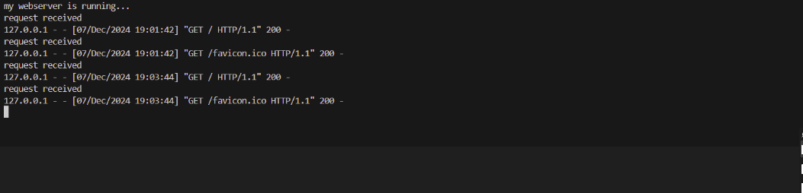
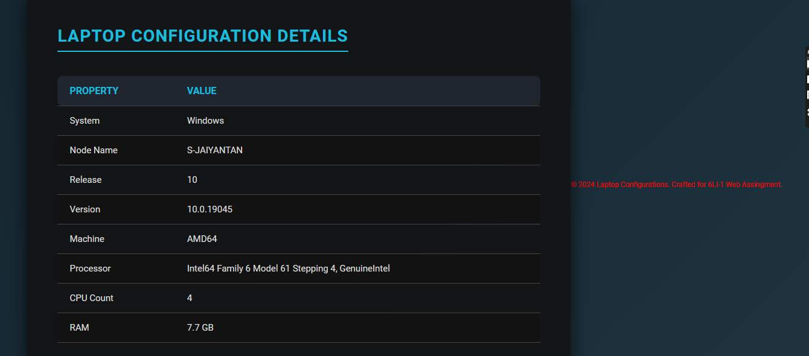

# EX01 Developing a Simple Webserver

# Date: 13/09/24
# AIM:
To develop a simple webserver to serve html pages and display the configuration details of laptop.

# DESIGN STEPS:
## Step 1:
HTML content creation.

## Step 2:
Design of webserver workflow.

## Step 3:
Implementation using Python code.

## Step 4:
Serving the HTML pages.

## Step 5:
Testing the webserver.

# PROGRAM:

# web.py:

    from http.server import HTTPServer,BaseHTTPRequestHandler
    content = """
        <!DOCTYPE html>
        <html lang="en">
        <head>
            <meta charset="UTF-8">
            <meta name="viewport" content="width=device-width, initial-scale=1.0">
            <title>Laptop Configuration</title>
            
        </head>
        <body>
            

                <h1>Laptop Configuration Details</h1>    
                <table>
                    <thead>
                        <tr>
                            <th>Property</th>
                            <th>Value</th>
                        </tr>
                    </thead>
                    <tbody>
                        
                        <tr>
                            <td>{{ key }}</td>
                            <td>{{ value }}</td>
                        </tr>
                        
                    </tbody>
                </table>
            

            
            

                © 2024 Laptop Configurations. Crafted for 6LI-1 Web Assingment.
            

        </body>
        </html>
    """
    class myhandler(BaseHTTPRequestHandler):  
        def do_GET(self):
            print("request received")
            self.send_response(200)
            self.send_header('content-type', 'text/html; charset=utf-8')
            self.end_headers()
            self.wfile.write(content.encode())
    server_address =('',8000)
    httpd=HTTPServer(server_address,myhandler)
    print("my webserver is running...")
    httpd.serve_forever()

    
# OUTPUT:

# RESULT:
The program for implementing simple webserver is executed successfully.
